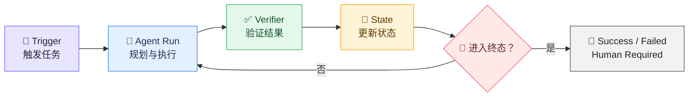
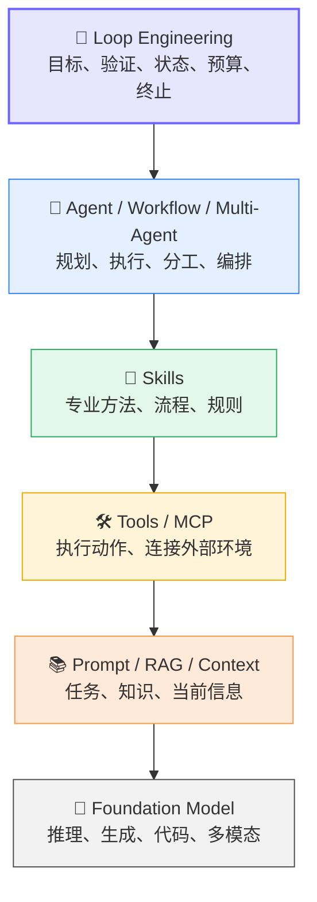
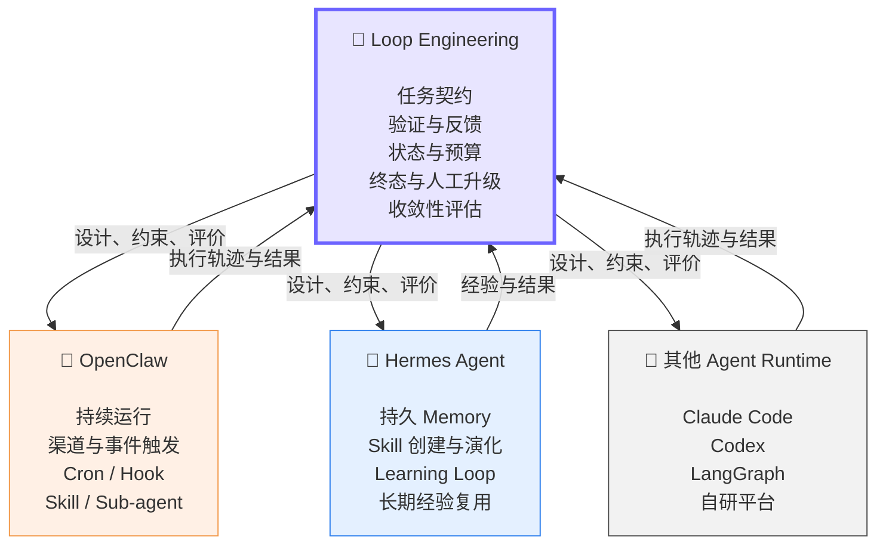

<p align="center">
  
  
</p>

<h1 align="center">🔁 Loop Engineering</h1>

<h3 align="center">让 Agent 循环真正可控、可验证、可收敛</h3>

<p align="center">
  <strong>OpenClaw、Hermes Agent 已经会循环，为什么还需要 Loop Engineering？</strong>
</p>

---

> [!IMPORTANT]
> **今天的核心问题不是：Agent 能不能循环？**
> 而是：当 Agent 已经能够循环后，我们如何设计一个具备明确目标、可靠验证、可控成本，并最终收敛到可信结果的循环？

---

# 🎬 一、从一个常见疑问开始

大家好，今天我们讨论的是一个最近开始被频繁提到的概念：

> ## **Loop Engineering**

很多人第一次听到这个词，会有一个非常自然的反应：

> Agent 本来就是循环的，还需要再发明一个 Loop 吗？

确实，一个典型的 Agent，本身就在不断执行这样的过程：

```text
Reason（思考）
   ↓
Act（执行）
   ↓
Observe（观察结果）
   ↓
继续思考
```

现在的 Agent 系统也已经非常强大：

* 🛠️ 可以调用工具 **Tool**
* 🧩 可以加载技能 **Skill**
* 🧠 可以长期保存记忆 **Memory**
* ⏰ 可以通过 **Cron** 定时运行
* 🔄 可以根据执行结果继续行动
* 🤖 可以启动子 Agent
* ♻️ 可以在失败后自动重试

OpenClaw、Hermes Agent 等系统，已经将这些能力做进了产品。

因此，我们今天真正需要回答的不是：

> Agent 能不能循环？

而是：

> ## **Agent 已经能够循环，但这个循环是否设计正确？**

换句话说：

* 它是否有明确目标？
* 它是否真的在取得进展？
* 它如何证明结果正确？
* 它什么时候应该停止？
* 它的成本和风险是否可控？
* 它最终能否收敛到可信结果？

这才是 **Loop Engineering** 要解决的问题。

---

# 📄 二、Loop Engineering 的来源：一篇近期论文

2026 年 6 月 28 日，Sandeco Macedo 在 arXiv 发布了一篇直接讨论 Loop Engineering 的预印本。

| 📌 项目    | 内容                                                                                               |
| -------- | ------------------------------------------------------------------------------------------------ |
| **论文标题** | *Stop Hand-Holding Your Coding Agent: Engineering the Loops that Replace Step-by-Step Prompting* |
| **作者**   | Sandeco Macedo                                                                                   |
| **领域**   | Software Engineering                                                                             |
| **论文编号** | arXiv:2607.00038                                                                                 |
| **发布日期** | 2026 年 6 月 28 日                                                                                  |
| **论文链接** | [arXiv 摘要与全文](https://arxiv.org/abs/2607.00038)                                                  |

> [!NOTE]
> 这篇论文不是在提出一个新模型或新 Agent 算法，而是在尝试给已经出现的 Loop 实践建立一套统一的**定义、结构和工程语言**。

---

## 💡 论文想解决什么问题？

传统的人机协作模式通常是：

```text
人给出任务
   ↓
Agent 执行
   ↓
人检查结果
   ↓
人整理反馈
   ↓
Agent 再次执行
```

在这个过程中，人实际上承担了多个角色：

* 任务调度器
* 结果验证器
* 状态记录器
* 反馈生成器
* 终止控制器

论文提出，可以将原本由人负责的这些工作，逐渐变成一个外部系统：

```text
发现任务
   ↓
启动 Agent
   ↓
检查执行结果
   ↓
记录当前状态
   ↓
决定继续 / 停止 / 转人工
```

也就是说：

> **人不再逐轮编写 Prompt，而是设计一个能够自动推动 Agent 工作的闭环系统。**

---

# 🧬 三、Loop Specification：循环的工程定义

论文提出了一个核心概念：

> ## **Loop Specification：循环规范**

Loop Specification 是一个有边界、可复用、可交给 Agent Runtime 执行的任务闭环。

一个完整的 Loop，至少需要明确以下要素：

| 要素                   | 含义    | 关键问题                     |
| -------------------- | ----- | ------------------------ |
| 🚦 **Trigger**       | 触发条件  | 什么时候开始？                  |
| 🎯 **Goal**          | 任务目标  | 最终需要达到什么结果？              |
| ⚙️ **Execution**     | 执行过程  | 使用哪些 Agent、Skill 和 Tool？ |
| ✅ **Verification**   | 验证机制  | 如何证明结果正确？                |
| 🛑 **Stopping Rule** | 停止条件  | 什么时候继续、停止或转人工？           |
| 🧠 **Memory**        | 状态与记忆 | 哪些进度和决策需要保存？             |

可以将它概括为：

```text
Loop Engineering
=
设计并评估 Loop Specification
```

或者进一步写成：

```text
Loop =
Trigger
+ Goal
+ Execution
+ Verification
+ Memory
+ Stopping Rule
```

---

# 🔍 四、三种不同的 Loop

这是理解 Loop Engineering 最关键的部分。

## ① 普通程序循环

```python
while not done:
    run()
```

它只是一种代码控制结构。

它不天然具备：

* 目标定义
* 结果验证
* 成本限制
* 风险管理
* 人工升级

---

## ② Agent 内部循环

```text
Reason → Act → Observe
```

它描述模型在一次 Agent Run 中如何：

* 思考下一步；
* 调用工具；
* 读取工具结果；
* 决定是否继续。

这通常由 Agent Runtime 或 Harness 提供。

---

## ③ Loop Engineering 关注的系统级循环

```text
触发任务
   ↓
选择 Agent / Skill
   ↓
执行任务
   ↓
验证结果
   ↓
更新状态
   ↓
继续 / 停止 / 转人工
```

它关注的是：

> 一个或多个 Agent Run，如何被组织成一个完整、可验收的业务闭环。



> **一句话区分：**
>
> **Agent Loop** 解决“Agent 如何执行”。
> **Loop Engineering** 解决“整个任务如何开始、验证、持续推进并结束”。

---

# ✅ 五、最重要的观点：难点不是 Prompt，而是验证

论文提出了一个非常关键的判断：

> ## **Loop 的核心不是重复生成，而是可靠验证。**

如果没有验证，一个循环可能只是：

```text
生成结果
   ↓
Agent 自己认为不错
   ↓
继续生成
   ↓
Agent 再次认为不错
```

这并不能证明结果真的在改善。

---

## 🪜 Verification Ladder：验证阶梯

| 层级             | 验证方式           | 典型示例                    | 可靠性     |
| -------------- | -------------- | ----------------------- | ------- |
| 🟢 **Level 1** | 确定性验证          | 测试、断言、退出码、精确结果          | 很高      |
| 🟢 **Level 2** | 规则与约束          | Schema、Lint、Policy、类型检查 | 较高      |
| 🟡 **Level 3** | 真实环境反馈         | 性能指标、部署结果、用户行为          | 取决于反馈质量 |
| 🟠 **Level 4** | Model as Judge | LLM 按 Rubric 打分         | 概率性判断   |
| 🔴 **Level 5** | 人工验证           | 专家审核、人工审批               | 成本较高    |

> [!WARNING]
> **Model as Judge 是概率性评价，不是确定性验证。**
>
> 对无人值守的自动化 Loop，应优先使用 Level 1、Level 2，以及可量化的 Level 3 验证。

Loop 的质量取决于 Verifier 是否能够真正推动系统纠错。

```text
没有 Verifier
=
Agent 不断同意自己

可靠 Verifier
=
Agent 根据证据不断修正自己
```

---

# 🏗️ 六、Loop Engineering 在 AI 技术栈中的位置

对于 Prompt、RAG、Tool 等概念，这里只做快速对齐。



| 层级                         | 解决的问题           |
| -------------------------- | --------------- |
| **Foundation Model**       | AI 是否具备推理和生成能力  |
| **Prompt / RAG / Context** | 当前要做什么、需要知道什么   |
| **Tool / MCP**             | 可以执行什么动作、连接什么环境 |
| **Skill**                  | 某一类任务应该按照什么方法完成 |
| **Agent / Workflow**       | 谁来规划、执行和编排      |
| **Loop Engineering**       | 系统如何验证、反馈、收敛和结束 |

> [!TIP]
> **Loop Engineering 不是一种新的模型能力。**
>
> 它更像是位于 Agent Runtime 之上的**控制层、验收层和治理层**。

---

# 🦞 七、OpenClaw 在做什么？

OpenClaw 可以理解为一个持续运行的 Agent 平台或 Gateway。

它提供的典型能力包括：

* ⏰ 定时任务：Cron
* 🪝 事件触发：Hook
* 🤖 子 Agent
* 🧩 Skill 系统
* 🛠️ 工具调用
* 📋 后台任务记录
* 🔀 多 Agent 协调

它主要解决的是：

> ## **Agent 如何被触发、持续运行并执行自动化任务。**

典型流程如下：

```text
消息 / 时间 / 事件触发
          ↓
加载 Agent 状态与 Skill
          ↓
调用 Tool
          ↓
必要时启动子 Agent
          ↓
记录任务状态
          ↓
返回执行结果
```

OpenClaw 已经提供了运行 Loop 所需的很多基础设施。

但它不会自动替业务设计：

* 什么叫成功；
* 什么证据足以证明成功；
* 最多运行多少轮；
* 连续无进展时怎么办；
* 哪些终态必须转交人工。

---

# 🪽 八、Hermes Agent 在做什么？

Hermes Agent 更强调：

> ## **Agent 如何通过 Memory 和 Skill，从长期经验中成长。**

它的核心能力包括：

* 🧠 **Memory**：保存事实、用户偏好和项目背景
* 🧩 **Skill**：保存可复用的方法与流程
* 🔄 **Learning Loop**：从任务经验中创建和改进 Skill
* 🤖 子 Agent
* ⏰ 定时任务
* 🛠️ 多种 Tool 与执行环境

Hermes 的学习循环可以概括为：

```text
执行任务
   ↓
发现可复用经验
   ↓
写入 Memory
   ↓
创建或改进 Skill
   ↓
后续任务复用
   ↓
继续积累经验
```

Hermes 解决的是：

> Agent 如何随着使用时间增加，积累更多知识和方法。

但这也会带来一个新的问题：

> 如果一次错误经验被写入 Memory，并进一步生成了错误 Skill，会发生什么？

```text
错误行为
   ↓
错误反思
   ↓
写入 Memory
   ↓
生成错误 Skill
   ↓
后续任务持续复用
```

因此：

> **Agent 的学习能力越强，Verifier 和治理机制就越重要。**

---

# 🧭 九、OpenClaw、Hermes Agent 与 Loop Engineering 的关系



## 📊 核心对比

| 维度       | 🦞 OpenClaw            | 🪽 Hermes Agent            | 🔁 Loop Engineering             |
| -------- | ---------------------- | -------------------------- | ------------------------------- |
| **基本类型** | Agent 平台与运行基础设施        | 自我改进型 Agent Runtime        | 工程方法与系统抽象                       |
| **核心目标** | 让 Agent 持续在线并执行任务      | 让 Agent 从经验中成长             | 让闭环可靠收敛                         |
| **主要循环** | 触发 → 运行 → 记录 → 交付      | 执行 → 记忆 → Skill → 复用       | 目标 → 执行 → 验证 → 反馈 → 终止          |
| **重点能力** | Trigger、Task、Sub-agent | Memory、Skill、Learning Loop | Verifier、Budget、Stop、Escalation |
| **适用范围** | OpenClaw 生态            | Hermes 生态                  | 跨 Agent、跨模型、跨 Runtime           |
| **最终回答** | Agent 如何运行？            | Agent 如何学习？                | 系统如何正确结束？                       |

> [!IMPORTANT]
> 它们不是互相替代的关系。
>
> **OpenClaw 和 Hermes 可以作为 Loop 的执行层；Loop Engineering 负责设计、约束和评价整个任务闭环。**

---

# ❓ 十、为什么还需要 Loop Engineering？

## ① 能循环，不等于能收敛

一个 Agent 可以执行 20 轮，但仍然可能：

* 一直重复相同操作；
* 在错误方向上持续优化；
* 逐渐偏离初始目标；
* 消耗越来越高；
* 最后仍无法证明任务完成。

因此：

> **能运行，不代表能完成。**
> **能循环，不代表能收敛。**

---

## ② 产品能力，不等于工程规范

OpenClaw、Hermes 提供了丰富能力，但一个具体任务仍然需要有人明确设计：

* 🎯 Goal：任务目标
* ✅ Verification：验证标准
* 💰 Budget：成本预算
* 🛑 Stop：停止条件
* 🚨 Escalation：人工介入规则

Loop Engineering 的作用，是将这些内容从隐含约定变成显式规范。

---

## ③ Agent 内部 Loop，不等于业务 Loop

Agent 内部循环：

```text
Reason → Act → Observe
```

业务闭环可能是：

```text
发现问题
   ↓
分析原因
   ↓
修改代码
   ↓
运行测试
   ↓
代码评审
   ↓
检查业务指标
   ↓
上线或回滚
```

Agent 内部循环可能只是业务闭环中的一个节点。

Loop Engineering 关注的是：

> 如何将一次或多次 Agent Run，组织成完整的业务闭环。

---

## ④ Hermes 的 Learning Loop，只是 Loop 的一种

Hermes 重点实现的是：

```text
经验 → Memory → Skill → 后续复用
```

但真实系统中还可能存在：

| Loop 类型       | 过程                                          |
| ------------- | ------------------------------------------- |
| ⚙️ **执行循环**   | 计划 → 执行 → 检查 → 修正                           |
| 📝 **生成评价循环** | Generator → Reviewer → Feedback → Generator |
| 🛡️ **运维循环**  | 监控 → 诊断 → 修复 → 验证                           |
| 🔬 **科研循环**   | 假设 → 实验 → 分析 → 更新假设                         |
| 📈 **产品循环**   | 反馈 → 修改 → 发布 → 测量                           |

Loop Engineering 试图提炼这些循环共同的工程结构。

---

## ⑤ 从“自主性”转向“收敛性”

Agent Engineering 通常关注：

```text
能不能自己规划？
能不能自己调用工具？
能不能自己创建 Skill？
能不能自己运行很久？
```

Loop Engineering 更关注：

```text
质量是否随轮次提升？
是否出现重复和震荡？
第几轮开始收益递减？
成本是否已经超过价值？
什么时候必须停止？
```

> ## **Agent Engineering 追求自主执行。**
>
> ## **Loop Engineering 追求受控收敛。**

---

# 🧰 十一、Loop Engineering 真正要设计什么？

```text
Loop Specification
=
Trigger（触发）
+ Goal（目标）
+ State（状态）
+ Action（执行）
+ Verifier（验证）
+ Feedback（反馈）
+ Budget（预算）
+ Stop（终止）
+ Escalation（人工介入）
+ Observability（可观测性）
```

---

## 🎯 1. 任务契约

需要明确：

* 输入是什么；
* 任务目标是什么；
* 不允许做什么；
* 什么叫成功；
* 什么叫失败。

不要只写：

```text
优化一下登录接口。
```

应该写：

```text
修复登录接口超时问题；

要求：
- 所有单元测试通过
- 所有集成测试通过
- P95 延迟低于 500ms
- 不得修改公开 API
- 不得降低安全检查等级
```

---

## ✅ 2. 验证契约

需要明确：

* 使用测试、规则还是业务指标；
* 哪些检查是确定性的；
* 是否使用独立 Reviewer；
* 是否允许 Model as Judge；
* 什么情况下必须人工验收；
* 多个 Verifier 冲突时如何处理。

---

## 🧠 3. 状态契约

需要明确：

* 什么进入当前 Context；
* 什么进入长期 Memory；
* 哪些失败经验值得保留；
* 错误 Memory 如何撤销；
* Skill 如何版本管理；
* 系统中断后如何恢复。

---

## 💰 4. 运行契约

需要明确：

* 最大运行轮数；
* 最大模型费用；
* 最大工具调用次数；
* 最长运行时间；
* 连续几轮无进展后停止；
* 哪些操作需要人工审批。

---

## 🛑 5. 终态契约

一个 Loop 不应该只有“完成”和“未完成”。

建议至少定义：

| 终态                     | 含义        |
| ---------------------- | --------- |
| ✅ **SUCCESS**          | 所有验收条件均满足 |
| ❌ **FAILED**           | 任务明确失败    |
| ⏸️ **BLOCKED**         | 被外部依赖阻塞   |
| 🔁 **NO_PROGRESS**     | 多轮没有取得进展  |
| 💸 **BUDGET_EXCEEDED** | 超出时间或成本预算 |
| ⚠️ **UNSAFE**          | 检测到高风险行为  |
| 👤 **HUMAN_REQUIRED**  | 需要人工判断或接管 |

---

# 🧪 十二、案例：修复登录接口超时

## 任务目标

> 修复登录接口超时问题。

---

## 方案一：普通 Agent

```text
Agent 修改代码
   ↓
Agent 表示完成
```

### 问题

* 没有独立验证；
* 完成状态由 Agent 自己判断；
* 没有预算和无进展检测。

---

## 方案二：OpenClaw / Hermes Agent

```text
触发任务
   ↓
加载 Memory 和 Skill
   ↓
Agent 修改代码
   ↓
运行测试
   ↓
必要时启动子 Agent
   ↓
保存并返回结果
```

### 优点

* 具备 Trigger；
* 可以调用 Tool；
* 可以使用 Skill；
* 可以持久化状态；
* 可以调用子 Agent。

### 仍需显式设计

* 成功条件；
* 验证强度；
* 成本预算；
* 终态；
* 人工升级规则。

---

## 方案三：Loop Engineering

### 🎯 成功条件

```text
- 单元测试全部通过
- 集成测试全部通过
- P95 延迟低于 500ms
- API Schema 不变
- Reviewer 无高危问题
```

### 💰 运行预算

```text
- 最多运行 5 轮
- 最多启动 3 个子 Agent
- 设置模型成本上限
- 连续 2 轮无进展则停止
```

### ⚙️ 执行闭环

```text
选择诊断 Skill
   ↓
Agent 分析并修改
   ↓
运行单元测试
   ↓
运行集成测试
   ↓
运行性能测试
   ↓
独立 Reviewer 审查
   ↓
更新任务状态
   ↓
继续或进入终态
```

### 🏁 终态

```text
SUCCESS
NO_PROGRESS
BUDGET_EXCEEDED
UNSAFE
HUMAN_REQUIRED
```

> **区别不在于有没有 Agent，而在于所有关键规则是否已经被显式设计。**

---

# ⚠️ 十三、边界与风险

Loop Engineering 不是万能的。

## 不适合使用 Loop 的任务

* 一次模型调用已经可以完成；
* 下一步不会根据反馈变化；
* 没有可验证的完成标准；
* 结果完全依赖主观审美；
* 操作不可逆且风险极高；
* 循环成本高于任务价值。

---

## 常见风险

| 风险                    | 表现                         |
| --------------------- | -------------------------- |
| ♾️ **无限循环**           | Agent 一直执行但无法进入终态          |
| 🔂 **重复行动**           | 不断尝试已经失败的方法                |
| 🧠 **错误记忆**           | 将错误判断写入长期 Memory           |
| 🧩 **Skill 污染**       | 将偶然成功固化成错误方法               |
| ⚖️ **Verifier 偏差**    | Reviewer 与 Generator 有相同盲区 |
| 🎯 **Reward Hacking** | Agent 绕过验证，而不是解决问题         |
| 💸 **成本失控**           | 多 Agent、多轮调用导致费用膨胀         |
| 🌫️ **上下文污染**         | 早期错误持续影响后续判断               |

因此，目标不是：

> 让 Agent 无限运行。

而是：

> ## **让 Agent 在有限成本、有限风险和明确验证条件下，持续产生可信进展。**

---

# 🏁 十四、总结

最后回到最开始的问题：

> OpenClaw、Hermes Agent 已经有了 Loop，为什么还需要 Loop Engineering？

答案不是：

> 因为它们没有循环。

而是：

> ## **拥有循环能力，与掌握如何设计可靠闭环，是两件不同的事。**

---

## 四句话总结

> 🦞 **OpenClaw：让 Agent 能够持续运行和执行任务。**

> 🪽 **Hermes Agent：让 Agent 能够积累经验和持续学习。**

> 🤖 **Agent Loop：让模型能够思考、行动和观察。**

> 🔁 **Loop Engineering：让整个系统能够验证、收敛并正确结束。**

---

## 最终关系

```text
OpenClaw / Hermes / Claude Code / Codex / 自研 Agent
                         ↓
                  提供执行能力
                         ↓
Loop Engineering 设计如何触发、组合、验证、控制和终止
```

---

> [!IMPORTANT]
>
> # **Loop Engineering 不是让 Agent 学会循环。**
>
> # **而是让循环变得可设计、可验证、可控制、可收敛。**

<p align="center">
  
  
  
</p>

<h3 align="center">谢谢大家 🙌</h3>

---

# 📚 参考资料

1. [Stop Hand-Holding Your Coding Agent: Engineering the Loops that Replace Step-by-Step Prompting](https://arxiv.org/abs/2607.00038)
2. [OpenClaw 官方网站](https://openclaw.ai/)
3. [OpenClaw Sub-agents 文档](https://docs.openclaw.ai/tools/subagents)
4. [Hermes Agent 官方文档](https://hermes-agent.nousresearch.com/docs/)
